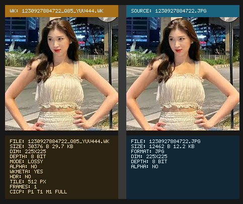

# WK

WK is an experimental still-image codec and container centered around a native `.wk` bitstream, structured `WKMETA` metadata, a small CLI toolchain, measurable image-quality analysis, and a desktop compare viewer for visual inspection.

The repo is currently focused on making the still-image workflow correct, measurable, and pleasant to inspect:

- `JPEG/PNG/PPM -> WK`
- `WK -> PNG/PPM`
- metadata import, edit, and export through `WKMETA`
- numeric quality measurement through `wkmetric`
- side-by-side compare and format inspection through `wkview`

WK is not claimed yet as a finished replacement for JPEG, WebP, or AVIF. The current stage is about correctness, observability, and iterative compression tuning before bigger claims are made.

## Demo

Below is a real `wkview` compare screenshot stored in this repo at `extra/1230927884722_q85_demo.png`.
It shows a decoded benchmark output against the original JPEG source.



The viewer is no longer just a raw image window. It now shows:

- the decoded `WK` panel and the original source panel side by side
- the filename on each side so the `.wk` result and source image are easy to distinguish
- file size for both sides
- image dimensions and bit depth
- alpha status
- `lossless` vs `lossy`
- `WKMETA`, `HDR`, tile size, frame count, and `CICP` information for the `.wk` side
- a better missing-file error with filename suggestions when you mistype a benchmark output path

That makes `wkview` useful both as a visual compare tool and as a quick format inspector when checking benchmark outputs.

## Current Status

What is in a good working state right now:

- lossless still-image encode/decode
- lossy still-image encode/decode
- lossy alpha preserved inside the `WK` tile payload
- shared image metrics through `wkmetric`
- strict container parsing with explicit failure on malformed files
- EXIF import into `WKMETA`
- PNG output for 8-bit decode
- side-by-side compare viewer with file and format information
- C and C++ public APIs
- unit and integration tests passing in the current tree

What is intentionally not claimed as finished yet:

- full animation encode/decode, even though the spec/container already has animation structures
- native `.webp` input/output support
- advanced HDR output writers
- full ICC-aware color-managed display in the viewer
- compression efficiency that already competes with mature JPEG/WebP/AVIF encoders

## What The Repo Looks Like Now

### Codec and container

- little-endian `.wk` container with `FHDR`, `META`, `ICCP`, `PROV`, `ANIM`, `TILE`, and `FEND` chunks
- strict parser rules:
- `FHDR` must be first
- `FEND` must exist and be last
- tile payload sizes are validated
- unknown required chunks are rejected
- unknown optional chunks are skipped safely
- tiled image layout with configurable tile size

### Lossy path

- RGB -> YCbCr conversion
- `YUV444` or `YUV420` chroma modes
- 8x8 DCT/IDCT
- quantization
- intra prediction
- `rANS` entropy coding
- lossy alpha stored directly in the tile payload when alpha exists
- decoder infers subsampling from tile payload geometry instead of hardcoding `YUV420`

### Measurement and inspection

- `wkmetric` compares a source image against another image or directly against a `.wk` file
- current metrics include file size, `MAE`, `MSE`, `PSNR`, `SSIM`, and per-channel breakdown
- `wkview` is used as the visual judge after the numeric pass
- corpus benchmark outputs are written to `benchmark/`

### Metadata

- `WKMETA` structured metadata chunk
- CLI editing via `wkmeta-edit`
- EXIF import from JPEG/TIFF donor files
- metadata export as JSON

## Platform Notes

The repo currently has the best day-to-day experience on Windows.

### Windows

- JPEG and PNG I/O use Windows WIC
- viewer is supported and buildable
- MinGW runtime DLLs are copied next to executables automatically
- the old `wkview` `LoadLibrary failed with error 1114` issue was fixed by copying runtime DLLs and forcing `MiniFB` away from the problematic OpenGL path on Windows

### Non-Windows

- the core library is more portable than the convenience image I/O layer
- the shared I/O layer only guarantees `PPM` outside Windows in the current tree
- JPEG/PNG workflow is effectively Windows-first right now

## Viewer Notes

A few practical notes for `wkview` based on the current repo behavior:

- benchmark outputs live in `benchmark/` and include the full profile suffix, for example `benchmark/2334937028374_q85_yuv444.wk`
- if you type the wrong filename, `wkview` now tries to suggest nearby matches instead of only failing with a generic open error
- if you still somehow hit the old Windows popup about `LoadLibrary failed with error 1114`, make sure you are launching the fresh executable from `build/` and not an older copied binary from another directory
- the viewer currently aims to be a reliable debug and compare window first, not a full color-managed HDR presentation app

## Build

### Requirements

- CMake `>= 3.28`
- a C++23 compiler
- on Windows, the repo is currently developed and tested with MSYS2 UCRT64 + MinGW
- Ninja is recommended

### Windows example

```powershell
$env:PATH='C:\msys64\ucrt64\bin;'+$env:PATH
cmake -S . -B build -G Ninja
cmake --build build --parallel
ctest --test-dir build --output-on-failure
```

Dependencies are fetched automatically by CMake:

- `minifb` for the viewer
- `googletest` for tests

## Quick Start

The bundled sample photo is:

- `photos/1230927884722.jpg`

### Encode lossless

```powershell
.\build\wkenc.exe --lossless photos\1230927884722.jpg photos\test_lossless.wk
```

### Encode lossy

```powershell
.\build\wkenc.exe --quality 75 photos\1230927884722.jpg photos\test_lossy.wk
```

### Decode

```powershell
.\build\wkdec.exe photos\test_lossy.wk photos\decoded_lossy.png
```

### Inspect info

```powershell
.\build\wkdec.exe --info photos\test_lossy.wk
```

### Measure a `.wk` against the source image

```powershell
.\build\wkmetric.exe photos\1230927884722.jpg photos\test_lossy.wk
```

### Compare visually in the viewer

```powershell
.\build\wkview.exe photos\test_lossy.wk photos\1230927884722.jpg
```

### View a benchmark output directly

```powershell
.\build\wkview.exe .\benchmark\2334937028374_q85_yuv444.wk .\photos\2334937028374.jpg
```

## Benchmark Workflow

Benchmark utilities now live under `utils/`.

### Run the corpus benchmark

```powershell
powershell -ExecutionPolicy Bypass -File .\utils\benchmark_corpus.ps1 -Quality 75 -Subsampling 444
```

Explicit `4:2:0` pass:

```powershell
powershell -ExecutionPolicy Bypass -File .\utils\benchmark_corpus.ps1 -Quality 75 -Subsampling 420
```

Lossless pass:

```powershell
powershell -ExecutionPolicy Bypass -File .\utils\benchmark_corpus.ps1 -Lossless
```

The generated `.wk` outputs and JSON summaries are written under `benchmark/`.

### Smoke script

A simple end-to-end smoke path also exists at:

- `utils/test_codec.sh`

That script now resolves the repo root before running, so it is no longer tied to the current shell working directory.

## Current Benchmark Snapshot

The current measured corpus summaries in this tree are:

- `benchmark/summary_q75_yuv444.json`
- `benchmark/summary_q85_yuv444.json`

Across the bundled three-image JPEG corpus, the current averages are:

| Profile | Total WK bytes | Avg PSNR | Avg SSIM |
| --- | ---: | ---: | ---: |
| `q75_yuv444` | `93,803` | `36.1580` | `0.968640` |
| `q85_yuv444` | `133,503` | `39.1305` | `0.982176` |

That means the current direction is behaving as expected:

- `q75` is the more balanced profile
- `q85` is the visibly cleaner profile
- `q85` still costs a lot more bytes, so rate-distortion tuning is still an active area of work

A concrete example from the current tree:

- `photos/2334937028374.jpg`: `6,072` bytes
- `benchmark/2334937028374_q75_yuv444.wk`: `15,027` bytes, `PSNR 36.7448`, `SSIM 0.972182`
- `benchmark/2334937028374_q85_yuv444.wk`: `20,180` bytes, `PSNR 39.6637`, `SSIM 0.984977`

## CLI Tools

### `wkenc`

Usage:

```text
wkenc [options] <input.{jpg,jpeg,png,ppm}> [output.wk]
```

Main options:

- `--quality N`
- `--lossless`
- `--tile-size N`
- `--threads N`
- `--target-ssimulacra2 N`
- `--yuv444`
- `--yuv420`
- `--import-exif FILE`

### `wkdec`

Usage:

```text
wkdec [options] <input.wk> [output.{png,ppm}]
```

Main options:

- `--info`
- `--export-meta FILE`

Notes:

- `.png` output is currently limited to 8-bit decoded images
- higher bit depths should use `.ppm` for now, or fail clearly if unsupported

### `wkmetric`

Usage:

```text
wkmetric [options] <reference.{wk,jpg,jpeg,png,ppm}> <candidate.{wk,jpg,jpeg,png,ppm}>
```

Main options:

- `--json`
- `--rgb-only`

Behavior:

- accepts normal images or `.wk` files on either side
- decodes `.wk` internally before comparing
- prints file size, `MAE`, `MSE`, `PSNR`, `SSIM`, and per-channel metrics

### `wkmeta-dump`

Prints `WKMETA` as JSON.

### `wkmeta-edit`

Usage:

```text
wkmeta-edit [options] <input.wk>
```

Main options:

- `--set NS.TAG VALUE`
- `--delete NS.TAG`
- `--import-exif FILE`
- `--export-json`
- `-o, --output FILE`

### `wkview`

Usage:

```text
wkview <file.wk> [source.{jpg,jpeg,png,ppm}]
```

Behavior:

- with only `.wk`, it shows the decoded image and `WK` format/file details
- with a second image path, it shows side-by-side compare
- the left panel is the decoded `WK`
- the right panel is the source image
- it displays file size and format details directly inside the window
- it suggests nearby filenames if the requested `.wk` path is mistyped

## Public API

### C++ API

Headers:

- `include/wk/wk.hpp`
- `include/wk/wkmeta.hpp`

Main entry points:

- `wk::encode(...)`
- `wk::decode(...)`
- `wk::get_info(...)`

### C API

Header:

- `include/wk/wk.h`

Main entry points:

- `wk_encode(...)`
- `wk_decode(...)`
- `wk_get_info(...)`
- `wk_free(...)`
- `wk_version(...)`

## Tests

Current test targets include:

- `rans_test`
- `dct_test`
- `roundtrip_test`
- `container_test`
- `predict_test`
- `wkmeta_test`
- `geo_roundtrip_test`
- `metrics_test`

The currently validated path includes:

- lossless round-trip
- lossy round-trip
- lossy alpha round-trip
- malformed entropy stream rejection
- malformed container rejection
- metadata round-trip
- metric correctness checks
- JPEG integration on Windows using the bundled sample photos

Run everything with:

```powershell
ctest --test-dir build --output-on-failure
```

## Repository Layout

```text
include/    public headers
src/        codec, container, metadata, image I/O, metrics
tools/      CLI tools and viewer
tests/      unit and integration tests
photos/     sample/testing assets
benchmark/  generated benchmark outputs and summaries
extra/      screenshots and demo assets
utils/      helper scripts for benchmarking and smoke runs
```

## Known Limitations

- native `.webp` input/output is not implemented
- animation structures exist in the format, but animation workflow is not complete yet
- JPEG/PNG convenience I/O is Windows-first in this repo
- PNG writing is 8-bit only
- viewer HDR preview is a deterministic 8-bit preview, not full color-managed HDR display
- compression still needs substantial tuning to become truly competitive on file size

## Suggested Next Steps

The current roadmap in practice is:

1. keep maturing rate-distortion tuning for lossy still images
2. move into entropy improvements after the current RD work is stable
3. strengthen the lossless path after that
4. continue viewer inspection tooling once the codec core is further stabilized
5. only then expand deeper into parity features such as animation and broader interchange support

## Reference Docs

For deeper reference, see:

- `SPEC.md` for the bitstream/container format
- `META_GUIDE.md` for metadata usage
- `BENCHMARK.md` for benchmark and testing notes
